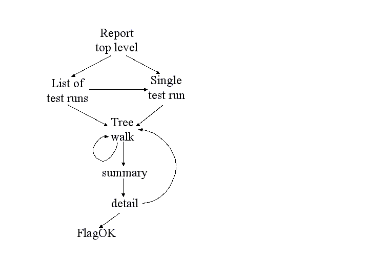
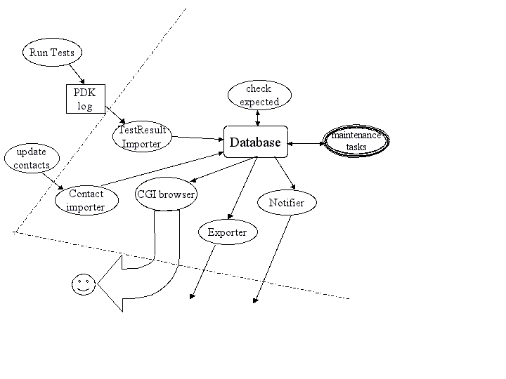

========
Overview
========

Philosophy
----------

Pandokia is designed as a lightweight test management and reporting system. 
It consists of loosely coupled set of components that:

  - discover test files
  - configure the test environment
  - invoke test runners to run tests contained in test files
  - import test results to a database
  - identify missing test results
  - display browsable (CGI) test reports from the database

Any test runner, reporting tool, or analysis tool that complies with
the interface between components can participate in the system.

Pandokia is a command line tool, invoked with a "pdk <verb>"
pattern. "pdk --help" shows the available commands.

We assume two primary use cases for Pandokia:
  - nightly or continuous-integration batch runs of the whole system
  - developer-driven manual runs of parts of the system

Environment, configuration, and disabled tests are managed with
special files, to make it as easy as possible for the developer.

Environment
-----------

The environment that is passed in to the test runner can be customized
for each directory of tests by creating a special file named
pdk_environment. The environment specifications in these files are
applied hierarchically: values set in a subdirectory will override
values set at a higher level. The resulting environment will be
merged with os.environ prior to running tests; in particular, any
PATH environment variable is handled specially, and appended to
(rather than overriding) existing values at a higher level.

The pdk_environment file is an INI-style file with named sections. The
[default] section applies to all tests; additional sections based on
operating system, machine architecture, or hostname may be included to
further customize the execution environment.

Notification
------------

Each directory may also contain a file named pdk_contacts. This file
should include the username or email address of individuals (one per
line) who should be notified about anomalous results for tests
contained in this directory. 

These files are applied cumulatively: thus, a project manager can
arrange to receive a notification email for all tests in a tree by
modifying only the pdk_contacts file at the top of the tree, while
individual developers can be listed at lower levels.

Test identifiers
----------------

Tests are identified by the tuple (test_run, project, host,
test_name). "Project" is an arbitrary basket containing some
hierarchically ordered set of tests. Some test_runs can be given
special names (eg, daily_YYYY-MM-DD). "Host" refers to the
machine on which the tests were run.

Test status
-----------

Pandokia presently supports the following statuses:

 - P = Test passed
 - F = Test failed
 - E = Test ended in error; did not complete
 - D = Test disabled: test was deliberately disabled
 - M = Test missing: test was expected to run, but no report was received

Tests can be disabled by developers. This can be useful for
chronically failing tests, and for tests that were written and
committed before the code to pass them was written, as in test-driven
development. 

A table of expected tests (by identifying tuple) is kept in the
database.  Any tests that were expected but not received will be
marked missing in the database.  The usual model is to run a set
of tests, import the results, then declare that those tests are all
expected; the result is that a new test can become "expected" simply
because it once reported a result.

Test attributes
---------------

Pandokia can collect additional information through the population of
test attributes.

Test definition attributes (TDAs) can be used to record input parameters or
other information about the definition of a test such as reference values.

Test result attributes (TRAs) can be used to record more detailed results
than a simple pass/fail status, such as computed values and
discrepancies.

Test configuration attributes (TCAs, planned for next release) 
can be used to record values of environment variables, software
versions for libraries that were used, and so on.

The browsable report generator will optionally show these values for a
selected set of tests, and will pull out all identical values for a
given attribute into a table near the top of the report. This makes it
easy to quickly identify what failing tests may have in common.

Browsable reports
-----------------

The browsable report generator allows the user to navigate through the
database of test results in tabular or tree form, gradually narrowing
the test set of interest down to the level of a single test report, if
desired. The figure illustrates the navigation paths supported by 
the interface.

  This figure shows the navigable flow through the browser report
  generator. 

The top level presents you with a list of test runs that are
available to browse through, and also the option to specify a given
test run (for example, the daily_latest run). 

Either path will take you to the treewalker, with which you can
navigate through the various test subsets, both hierarchically through
the test namespace, and by project, host, test run, and status.

Once you've narrowed to a subset of interest, the "show all" link will
take you to a summary report for this set. The summary report presents
a table with one row per test, including contact and
status. The summary report permits the comparison of this subset to
the same subset in another test; displaying test attributes; and
sorting by table column.

Clicking on a test name takes you to the detailed report for a single
test, which contains all the information about the test available in
the database. For tests that are "OK-aware", a "FlagOK" button is
present on this form, that can be used to mark a failed test "OK". 

From the detailed report, you can return to the treewalker

The following screen shots illustrate several commonly-used reports in
the system:

 - A :download:`daily report <screen1.html>` in tabular form
 - An :download:`intermediate report <screen2.html>` from a tree-navigation
 - A :download:`single test result <screen3.html>`
 - A set of failing tests that have :download:`attributes in common <screen4.html>`

Internal workflow
-----------------

A high-level view of the system is quite simple, as illustrated in
figure: running tests produces a log file containing
test result data, usually with many test results appended in a
single file. An importer processes the log file and loads the data
into the database. The accumulated results are then available to
users through a CGI browser interface.

.. figure:: simple_dfd.png

   High-level view of system dataflow.

This section discusses the internal workings of the system, as
illustrated in the more complex diagram below.

   This figure shows the elements of Pandokia in more detail. The dashed
   line marks the boundary of the machine on which the database
   resides. All tasks that interact directly with the database are
   run on this machine.

In addition to the standard test-import-browse data flow, some
additional flows provide enhanced bookkeeping. 

  - Multiple contacts can be associated with sets of tests; this information may change, and changes must be imported.

  - A notifier sends a customized email with reports of any anomalous (fail, error, or missing) test results.

  -  Missing tests are detected by checking against a list of expected tests, which is automatically updated when new tests are added. 

  - Test reports can be exported from the database, and a small set of database maintenance utilities are provided.

Test discovery is performed hierarchically in a directory tree.
Each directory may contain special files specifying the environment,
contact information, or filename patterns; this information is
applied hierarchically, so that the configuration in a parent
directory applies to its children unless the children override it.
A test named testfoo.py may be disabled by placing a file in the
same directory named testfoo.disable. The test discoverer will not
pass this file to any test runner.

The test meta-runner invokes the correct test runner within an
appropriately configured environment for each test file found
(locally, we use nose and a home-grown system). When processing a
directory tree, multiple test runners can be invoked concurrently,
but only one test runner at a time will be invoked per directory.
For concurrent runs, the various output files are gathered up into
a single file for import.

The importer processes a test result file and uses the information
in it to update the various database tables. The missing test
identifier then compares the tests found in a given run against the
set of expected tests, and inserts records for any missing tests with
a status of missing. If a test report is imported for a test
previously considered missing, the database will be updated accordingly.

The reporter provides a browsable interface to several reports,
organized by lists or by trees. The user can examine attributes for a
group of tests, compare results to a previous test run, or click
through to an individual test report.

Interfaces
----------

Any test runner that produces a Pandokia-compliant test result file
can be used with the test reporting system. (A nose plugin has been
written that produces such a file.)

Any reporter or analysis tool that understands the Pandokia database
schema can be used to query the database, which is presently
implemented in SQLite.

Authors
-------
   Mark Sienkiewicz (STScI) and Vicki Laidler (CSC/STScI),
   Science Software Branch, Space Telescope Science Institute

   
Support
-------
   You can request help on Pandokia by sending email to help@stsci.edu
   with STSDAS/Pandokia in the subject line. The authors also follow
   the TIP mailing list (testing-in-python@lists.idyll.org).

