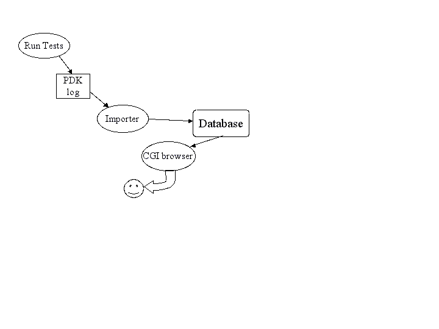

========
Overview
========

Philosophy
----------

You don't run tests because it is virtuous; you run tests because
you need to see the results from those tests.  If you have many
tests, the results can be difficult to manage.

Pandokia is a system for displaying those test results.

The two major subsystems are:

 -  A web-based user interface for reporting.  It uses a CGI, so
    there is no complicated server configuration.

 -  An optional system for executing tests.  It can run tests
    written for many different test frameworks, all in a single
    test run.  There is direct support for tests in py.test (python), 
    nose (python), unittest2 (python), shunit2 (sh), FCTX (C/C++),
    or even stand-alone programs.  You can add your own methods for
    executing other types of tests.

    You don't need to use pandokia to run your tests.  The database
    ingest reads a simple text format; anything that can produce
    pandokia-formatted data can report test results.  There is also
    an experimental interface for reading JUnit/XML data, but the
    pandokia format contains fields that JUnit does not report.

We assume two primary use cases for Pandokia:

  - continuous-integration batch runs of the whole system
  - developer-driven manual runs of parts of the system

The reports understand that you will run the same test code many
times.  Each test result is identified by a unique tuple:

 -  test_run is the name of this instance of running a batch of
    tests.  The name is arbitrary, but often fits a pattern such
    as "daily_2010-04-12" or "user_henry_ticket87".

 -  project is a project name; a CI system may integrate tests from
    several projects into a single report.

 -  context identifies something about the environment where the
    test was run.  We sometimes name contexts for the version of
    python the test ran in, or for a particular system configuration.

 -  host is which computer the test ran on.  Our CI system runs the
    same tests on many different operating systems.

 -  test_name is the name of a particular test.  The reporting system
    understands that test names fit into a hierarchy, much like
    files are organized in directories.  Test names are arbitrary,
    but the test runners that Pandokia provides will name the test
    by the directory where the test file is located, the name of
    the file containing the test, and the name of a function/class
    that implements the test.

    The system assumes that you always use the same name for
    the same test, so that you can compare results across test runs,
    hosts, or contexts.

After you ingest the test results into the database, there are reports
that cover:

 -  all currently known test runs

 -  a tabular report of all information about a single test run, or
    a project within that test run

 -  a tree view of the results, with "drill down"

 -  a summary of an arbitrary list of tests, with operators to
    add/remove tests from the list and combine lists

 -  details of a specific test, including captured stdout/stderr and
    various values ("attributes") that the test reported

Test status
-----------

We find it useful to have more to a test status than just "pass"
or "fail".  Pandokia presently supports the following statuses:

 - P = Passed
 - F = Failed
 - E = Error: there was a problem running the test
 - D = Disabled: test was directed to not run
 - M = Missing: test was expected to run, but no report was received

Tests can be disabled by developers. This can be useful for
chronically failing tests, and for tests that were written and
committed before the code to pass them was written, as in test-driven
development. 

A table of expected tests (by identifying tuple) is kept in the
database.  Any tests that were expected but not received will be
marked missing in the database.  The usual model is to run a set
of tests, import the results, then declare that those tests are all
expected; the result is that a new test can become "expected" simply
because it once reported a result.

Test attributes
---------------

Pandokia can collect additional information beyond simple Pass/Fail by
declaring "attributes".

Test definition attributes (TDAs) can be used to record input parameters or
other information about the definition of a test such as reference values.

Test result attributes (TRAs) can be used to record more detailed results,
such as computed values and magnitude of discrepancies.

The browsable report generator will optionally show these values for a
selected set of tests, and will pull out all identical values for a
given attribute into a table near the top of the report. This makes it
easy to quickly identify what failing tests may have in common.

Browsable reports
-----------------

The browsable report generator allows the user to navigate through the
database of test results in tabular or tree form, gradually narrowing
the test set of interest down to the level of a single test report, if
desired. The figure illustrates the navigation paths supported by 
the interface.

.. figure:: report_flow.png

  This figure shows the navigable flow through the browser report
  generator. 

The top level presents you with a list of test runs that are
available to browse through, and also the option to specify a given
test run (for example, the daily_latest run). 

Either path will take you to the treewalker, with which you can
navigate through the various test subsets, both hierarchically through
the test namespace, and by project, host, test run, and status.

Once you've narrowed to a subset of interest, the "show all" link will
take you to a summary report for this set. The summary report presents
a table with one row per test, including contact and
status. The summary report permits the comparison of this subset to
the same subset in another test; displaying test attributes; and
sorting by table column.

Clicking on a test name takes you to the detailed report for a single
test, which contains all the information about the test available in
the database. For tests that are "OK-aware", a "FlagOK" button is
present on this form, that can be used to mark a failed test "OK". 

From the detailed report, you can return to the treewalker.

The following screen shots illustrate several commonly-used reports in
the system:

 - A :download:`daily report <screen1.html>` in tabular form
 - An :download:`intermediate report <screen2.html>` from a tree-navigation
 - A :download:`single test result <screen3.html>`
 - A set of failing tests that have :download:`attributes in common <screen4.html>`

Internal workflow
-----------------

A high-level view of the system is quite simple, as illustrated in
figure: running tests produces a log file containing
test result data, usually with many test results appended in a
single file. An importer processes the log file and loads the data
into the database. The accumulated results are then available to
users through a CGI browser interface.

   High-level view of system dataflow.

This section discusses the internal workings of the system, as
illustrated in the more complex diagram below.

.. figure:: complex_dfd.png

   This figure shows the elements of Pandokia in more detail. The dashed
   line marks the boundary of the server that hosts the web interface.

In addition to the standard test-import-browse data flow, some
additional flows provide enhanced bookkeeping. 

  - Multiple contacts can be associated with sets of tests; this information may change, and changes must be imported.

  - A notifier sends a customized email with reports of any anomalous (fail, error, or missing) test results.

  -  Missing tests are detected by checking against a list of expected tests, which is automatically updated when new tests are added. 

  - Test reports can be exported from the database, and a small set of database maintenance utilities are provided.

Test discovery is performed hierarchically in a directory tree.
Each directory may contain special files specifying the environment,
contact information, or filename patterns; this information is
applied hierarchically, so that the configuration in a parent
directory applies to its children unless the children override it.
A test named testfoo.py may be disabled by placing a file in the
same directory named testfoo.disable. The test discoverer will not
pass this file to any test runner.

The test meta-runner invokes the correct test runner within an
appropriately configured environment for each test file found
(locally, we use nose and a home-grown system). When processing a
directory tree, multiple test runners can be invoked concurrently,
but only one test runner at a time will be invoked per directory.
When running multiple tests concurrently, the system creates
multiple log files.  All the log files are imported into the
database to obtain the full results.

The importer processes a test result file and uses the information
in it to update the various database tables. The missing test
identifier then compares the tests found in a given run against the
set of expected tests, and inserts records for any missing tests with
a status of missing. If a test report is imported for a test
previously considered missing, the database will be updated accordingly.

The reporter provides a browsable interface to several reports,
organized by lists or by trees. The user can examine attributes for a
group of tests, compare results to a previous test run, or click
through to an individual test report.

Authors
-------
   Mark Sienkiewicz (STScI) and Vicki Laidler (CSC/STScI),
   Science Software Branch, Space Telescope Science Institute

Support
-------
   You can request help on Pandokia by sending email to help@stsci.edu
   with SSB/Pandokia in the subject line. The authors also follow
   the TIP mailing list (testing-in-python@lists.idyll.org).

